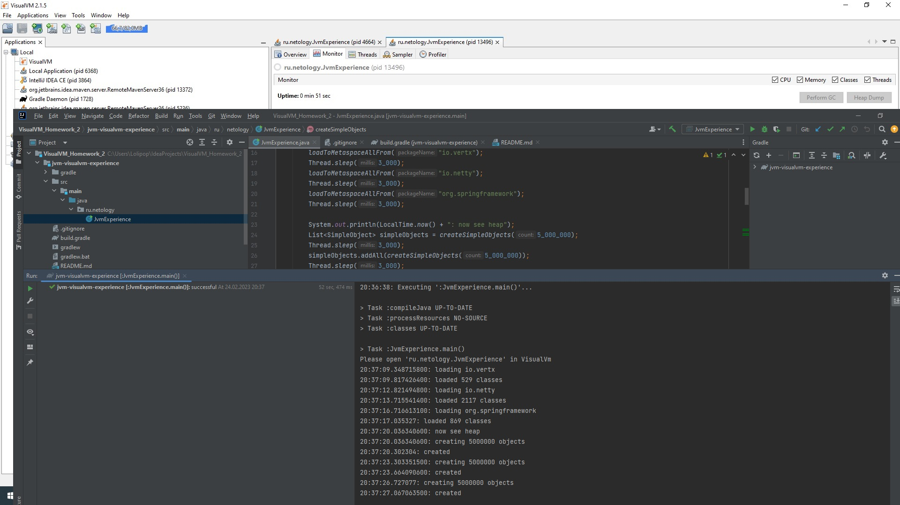
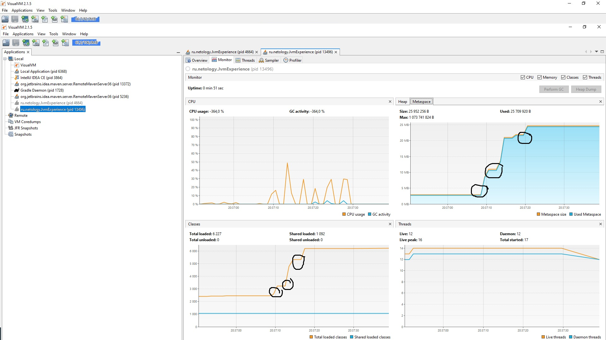
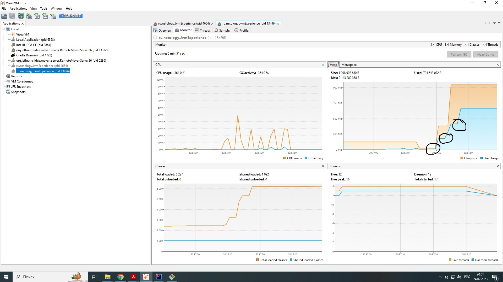

# Здравствуйте :-)

## В предоставленном коде для тестов памяти, по сути идет нагрузка на 2 раздела памяти  

- Metaspace  
- heap  
  
  
как видно из скриншота
  
  
  
## в metaspace идет загрузка классов с перерывами из 3 фреймворков:
+ Vertx c 529 классами
+ Netty с 2117 классами
+ Spring Framework с 869 классами
  
из скриншота  
  

### видно как на правом верхнем информационном окне заполняется память метаспэйса тремя скачками, и количество используемых мегабайт
### на левом нижнем информационном окне количество подгружаемых классов

## теперь куча   
здесь идет заполнение кучи тремя порциями по 5000000 шт обьектов  
из скриншота   
    

### на правом верхнем информационном окне 3 скачка заполнения, синим цветом информатируется фактическое заполнение памяти, оранжевым размер кучи
